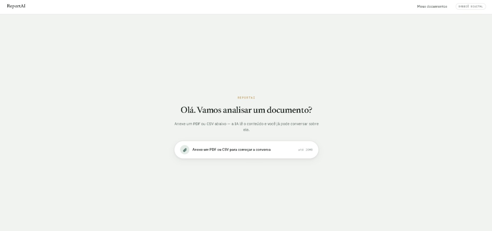
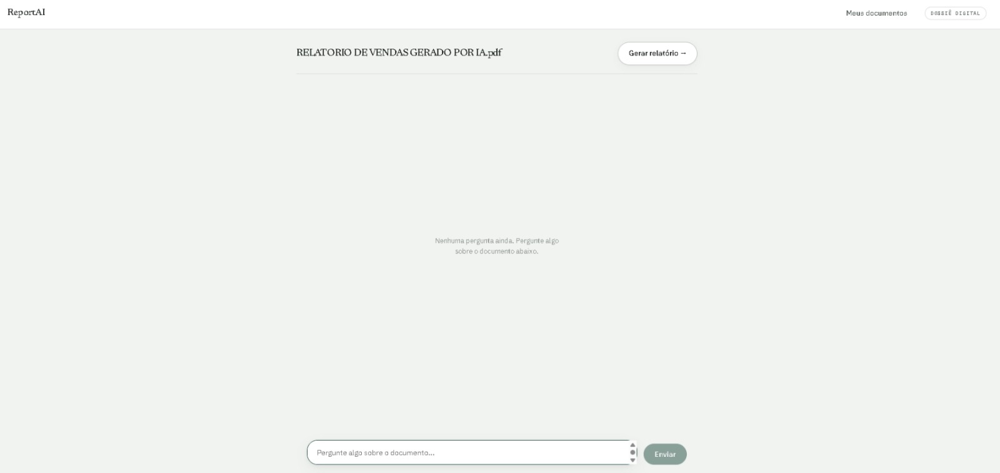
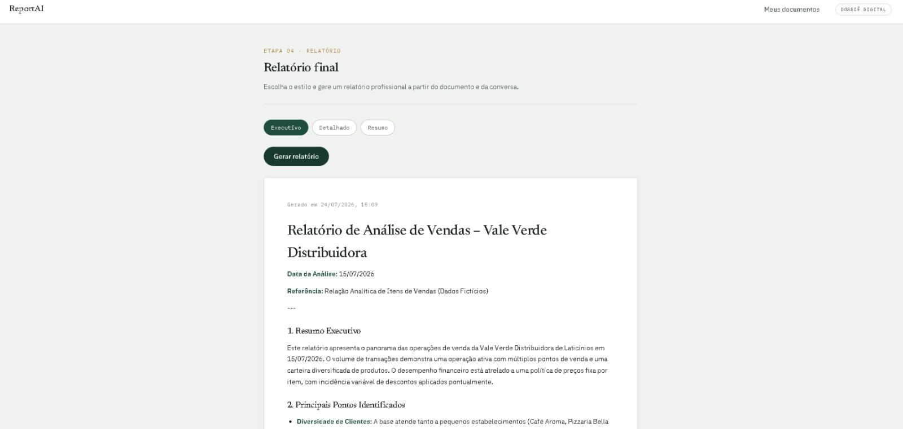

# 📄 ReportAI

<p align="center">
  
</p>

<p align="center">


</p>

---

# 🚀 Sobre

O **ReportAI** é uma aplicação Full Stack que utiliza Inteligência Artificial para analisar documentos enviados pelo usuário.

Após fazer upload de um **PDF** ou **CSV**, a aplicação:

- 📄 extrai automaticamente o texto;
- 🤖 permite conversar com o documento através de IA;
- 📊 gera relatórios profissionais em Markdown;
- 💾 salva o histórico da conversa.

A ideia do projeto foi reproduzir uma experiência semelhante ao Claude ou ChatGPT, porém focada na análise de documentos corporativos.

---

# ✨ Funcionalidades

- Upload de PDF
- Upload de CSV
- Extração automática de texto
- Chat contextual com IA
- Histórico de conversas
- Geração automática de relatórios
- API REST
- Banco de dados
- Interface moderna inspirada no Claude

---

# 📷 Screenshots

## Home



---

## Chat



---

## Relatório



---

# 🏗 Arquitetura

```
                React + Vite
                     │
                     │ HTTP / JSON
                     ▼
            Spring Boot REST API
                     │
        ┌────────────┼────────────┐
        │            │            │
     PDFBox     Commons CSV    Gemini API
        │            │            │
        └────────────┼────────────┘
                     │
                    H2
```

---

# 🛠 Tecnologias

## Frontend

- React
- Vite
- React Router
- Axios
- CSS

---

## Backend

- Java 21
- Spring Boot
- Spring Data JPA
- Hibernate
- Maven
- H2 Database
- Lombok
- Jackson
- Apache PDFBox
- Apache Commons CSV

---

## Inteligência Artificial

- Google Gemini API

---

# 📂 Estrutura do Projeto

```text
ReportAI/

├── reportai-backend/
│   ├── controller/
│   ├── service/
│   ├── repository/
│   ├── entity/
│   ├── dto/
│   ├── mapper/
│   ├── ai/
│   ├── document/
│   ├── report/
│   ├── exception/
│   ├── config/
│   └── util/

└── reportai-frontend/
    ├── components/
    ├── hooks/
    ├── pages/
    ├── services/
    └── utils/
```

---

# ⚙ Fluxo da Aplicação

```text
Upload do documento

        │

        ▼

Extração do texto

        │

        ▼

Armazenamento

        │

        ▼

Envio para IA

        │

        ▼

Chat com documento

        │

        ▼

Relatório final
```

---

# 🚀 Como executar

## Backend

```bash
git clone https://github.com/andreperinn/ReportAI.git

cd ReportAI

cd reportai-backend

./mvnw spring-boot:run
```

## Frontend

```bash
cd ReportAI

cd reportai-frontend

npm install

npm run dev
```

## Configuração da API do Gemini

Antes de iniciar o backend, configure a variável de ambiente `AI_API_KEY`.

### Windows (PowerShell)

```powershell
$env:AI_API_KEY="SUA_CHAVE_DO_GEMINI"
```

### Linux / macOS

```bash
export AI_API_KEY="SUA_CHAVE_DO_GEMINI"
```

# 📡 API

## Upload

```
POST /api/documents
```

---

## Buscar documento

```
GET /api/documents/{id}
```

---

## Conversar

```
POST /api/documents/{id}/chat
```

---

## Histórico

```
GET /api/documents/{id}/chat
```

---

## Gerar relatório

```
POST /api/documents/{id}/report
```

---

# 💡 Principais Aprendizados

Durante o desenvolvimento foram aplicados conceitos como:

- Arquitetura REST
- Clean Architecture
- Spring Boot
- React Hooks
- Consumo de APIs
- Integração com IA
- Manipulação de PDF
- Persistência de dados
- Engenharia de Software

---

# 🔮 Melhorias Futuras

- Login de usuários
- PostgreSQL
- Docker
- Deploy na nuvem
- Processamento assíncrono
- Preview do PDF
- Exportação em PDF
- Dashboard de estatísticas

---

# 👨‍💻 Autor

## André Perin

Estudante de Engenharia de Software apaixonado por desenvolvimento Full Stack e Inteligência Artificial.

💼 LinkedIn: https://www.linkedin.com/in/andr%C3%A9-perin-a7242b2b7/

💻 GitHub: https://github.com/andreperinn

---

# ⭐ Gostou do projeto?

Se este projeto foi interessante, deixe uma ⭐ no repositório.
